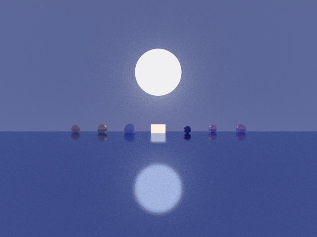

## How to Run
Guidance on how to build & run this code can be found in [run.md](run.md).

## Demo
[CS 5360 | Summer II 2023 | Final Project](https://youtu.be/-T_SJDsE9nI)

### Screenshots
#### GIFs
40 Frames @ 8 FPS

20 Frames @ 4 FPS

#### Scene Initial State

#### Scene Halfway State (Approx.)

#### Scene End State

## External Resources
  * [_Ray Tracing in One Weekend_](https://raytracing.github.io/books/RayTracingInOneWeekend.html) - Referenced for Metal, Lambertian, & Dielectric materials.
  * [_Ray Tracing: The Next Week_](https://raytracing.github.io/books/RayTracingTheNextWeek.html) - Referenced emissive materials. Also took some inspiration for translating hittable shapes, but I implemented this functionality as a behavior as opposed to the class structure offered in the book.
  * [_Physically Based Rendering - Chapter 9: Materials_](https://www.pbr-book.org/3ed-2018/Materials/Material_Interface_and_Implementations) - Referenced for mixed materials.